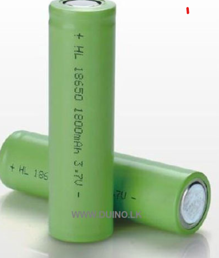

# VR Multiplayer Golf Game

## Overview

The **VR Multiplayer Golf Game** is an immersive virtual reality experience that combines physical hardware with a mobile VR environment, enabling players to swing a real-world golf stick and interact with a wearable controller for enhanced realism. Designed for Android smartphones and compatible with standard VR headsets (Google Cardboard), this project allows two players to connect, communicate, and compete on stunning virtual golf courses—no matter where they are in the world.

##Version Control & Collaboration
We used Unity Version Control for managing the project's source code and collaboration between team members.

## Table of Contents

- [Features](#features)
- [System Architecture](#system-architecture)
- [Hardware Stack](#hardware-stack)
- [Device Connectivity](#device-connectivity)
- [Technologies Used](#technologies-used)
- [How to Play](#how-to-play)
- [How to Work](#how-to-work)
- [Team](#team)

---

## Features

- **Real-time Multiplayer:** Play against friends in a synchronized VR environment.
- **Physical Interaction:** Use a custom-built golf stick and handwear controller for realistic swing and motion tracking.
- **Voice Chat:** Communicate live with your opponent using secure, low-latency voice chat.
- **Google Authentication:** Sign in easily and use your Google profile picture as your in-game avatar.
- **Custom Avatars:** Display your Google profile image in the game.
- **Session Statistics:** Track shots, scores, and game progress in real time.
- **Haptic Feedback:** Feel every swing and impact through vibration motors in the hardware.
- **Cross-Platform Play:** Works on any Android phone with VR headset support.

---

## System Architecture

The system consists of:
- **Client Devices:** Android smartphones running the Unity VR app, mounted in VR headsets.
- **Physical Controllers:** ESP32-powered golf stick and handwear controller, each with sensors and buttons.
- **Networking:** Photon Cloud for multiplayer synchronization and voice chat.
- **Authentication:** Google Sign-In for secure login and custom avatars.

### Data Flow

1. **Input:** User swings golf stick or presses a button; ESP32 reads sensor data.
2. **Transmission:** ESP32 sends data via Wi-Fi UDP to the smartphone.
3. **Processing:** Unity app interprets the data, updates the VR environment, and synchronizes actions with the Photon Cloud.
4. **Feedback:** Haptic motors provide physical feedback, and voice chat enables real-time communication.

---

## Hardware Stack

| Component         | Description                                                 | Image                                      |
|-------------------|------------------------------------------------------------|--------------------------------------------|
| ESP32 (30-pin)    | Core controller, Wi-Fi/BLE, sensor interfacing             |       |
| Push Button       | Triggers swing/menu actions                                |      |
| Vibrator Motor    | Haptic feedback on swing/impact                            |  |
| Li-ion Battery    | 3.7V rechargeable, powers the stick                        |    |
| Buck Module   | step down 3.7x2 = 7.4 to 5v                        |    |

#### Circuit Diagram

---

## Device Connectivity

- **ESP32 controllers** in both the golf stick and handwear module collect sensor/button data.
- Data is transmitted via **Wi-Fi UDP** to the smartphone running the Unity VR app.
- The app processes this data for real-time gameplay and synchronizes player actions using **Photon PUN** and **Photon Voice**.
- **WiFi** is also used for some sensor data transmission.

---

## Technologies Used

| Layer                  | Technology/Tool                                   |
|------------------------|--------------------------------------------------|
| Game Engine            | Unity 2022.3.62f1                                |
| Networking             | Photon PUN & Photon Voice                        |
| Authentication         | Google Sign-In (Firebase Auth/Unity Social APIs) |
| VR Implementation      | Google Cardboard Plugin                          |
| Controller             | ESP32, WiFi                                      |
| Programming Languages  | C# (Unity), C++ (ESP32), Java (Unity Plugins)    |
| Platform               | Android VR Devices                               |
| Input APIs             | Unity Input System                               |
| Build System           | Gradle / Unity Build Pipeline                    |
| Communication          | BLE, Wi-Fi UDP, Photon Cloud                     |
| Voice Chat             | Photon Voice (AES-256 encryption)                |

---

## How to Play

1. **Install** the game on your Android phone.
2. **Login** using your Google account.
3. **Connect** the ESP32-based golf stick and handwear controller via Wi-Fi.
4. **Start a Session:** The admin user creates a session and shares the code with the other player.
5. **Join:** The second player enters the code to join the game.
6. **Mount** your phone in a VR headset (Google Cardboard or similar).
7. **Play:** Swing the golf stick and use the handwear controller to interact with the VR world. Take turns, communicate via voice chat, and compete to win!

---

## Team

- **Kavindu Methpura**
- **Binuri Senavirathna**
- **Rashmika Sewmini**
- **Janith Wanasinghe**

---

## Summary

The VR Multiplayer Golf Game provides a unique, realistic, and social VR sports experience by blending custom hardware with advanced mobile VR technology. With real-time multiplayer, voice chat, and physical feedback, it brings the excitement of golf to the virtual world—anywhere, anytime.

---

*For more details, see the [Comprehensive Documentation PDF](docs/docs/user_manual.pdf).*
